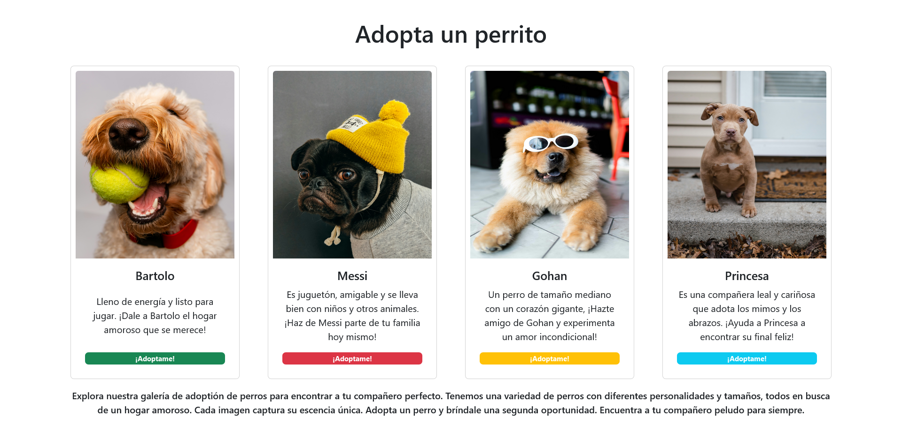

# Desafío 1 - Adopta un perrito 🐶

En este desafío, he aplicado los conocimientos de la unidad "Introducción a React" para desarrollar una galería de imágenes de perritos disponibles para adopción.

## Descripción del Desafío 📝

El objetivo de este desafío era crear una aplicación web utilizando React que mostrara una galería de imágenes de perritos disponibles para adopción. La aplicación debe contar con componentes para el encabezado, las tarjetas de cada perrito, las etiquetas y el pie de página.

## Capturas de Pantalla 🖼️

### Maqueta General


## Requerimientos del Desafío 🎯

1. **Creación de la Aplicación de React utilizando Vite:** La aplicación debe ser desarrollada utilizando Vite como herramienta de construcción.

2. **Creación del Componente Header.jsx:** Se debe crear un componente Header que muestre el título "Adopta un perrito". El título debe ser especificado desde App.jsx a través de un prop.

3. **Creación del Componente MyCard.jsx:** Se debe crear un componente MyCard que reciba como props la dirección de la imagen, el nombre y la descripción del perrito. Estos datos deben ser pasados desde App.jsx.

4. **Creación del Componente Tags.jsx:** Se debe crear un componente Tags que se importe dentro de cada Card. Este componente utilizará el Badge de Bootstrap y recibirá como props el texto y color de fondo desde App.jsx.

5. **Generación del Componente Footer.jsx:** Se debe generar un componente Footer que muestre el pie de página con una breve descripción de la galería de imágenes.

6. **Importación de Componentes en App.jsx:** El componente App.jsx debe importar los componentes Header, Footer y varias instancias del componente MyCard.

7. **Uso de CSS para Modificar los Estilos:** Se deben utilizar estilos CSS para modificar los estilos necesarios y recrear el diseño proporcionado.

## Solución a Requerimientos 😉

1. **Creación de la Aplicación de React utilizando Vite:**
- npm create vite@latest

2. **Creación del Componente Header.jsx:**
```javascript
const Header = ({ titleText }) => {
  return (
    <header>
      <h1>{titleText}</h1>
    </header>
  );
}

export default Header;
```

3. **Creación del Componente MyCard.jsx:**
```javascript
import Card from 'react-bootstrap/Card';
import Tags from './Tags';

const MyCard = ({ imgSrc, name, description, text, color }) => {
  return (
    <Card style={{ width: '18rem' }}>
      <Card.Img variant="top" src={imgSrc} />
      <Card.Body>
        <Card.Title>{name}</Card.Title>
        <Card.Text>
          {description}
        </Card.Text>
        <Tags colorBadge={color} textBadge={text} />
      </Card.Body>
    </Card>
  );
}

export default MyCard;
```

4. **Creación del Componente Tags.jsx:**
```javascript
import Badge from 'react-bootstrap/Badge';

const Tags = ({ colorBadge, textBadge }) => {
  return (
    <div className='badge-container'>
      <Badge bg={colorBadge}>{textBadge}</Badge>
    </div>
  );
}

export default Tags;
```

5. **Generación del Componente Footer.jsx:**
```javascript
const Footer = ({ text }) => {
  return (
    <footer>
      <p>{text}</p>
    </footer>
  );
}

export default Footer;
```

6. **Importación de Componentes en App.jsx:**
```javascript
import 'bootstrap/dist/css/bootstrap.min.css';
import './App.css'
import Header from './components/Header.jsx'
import MyCard from './components/MyCard.jsx'
import Footer from './components/Footer.jsx';

function App() {
  return (
    <>
      <Header titleText="Adopta un perrito" />

      <main>
        <MyCard imgSrc="https://images.unsplash.com/photo-1612502169027-5a379283f9c0" name="Bartolo" description="Lleno de energía y listo para jugar. ¡Dale a Bartolo el hogar amoroso que se merece!" color="success" text="¡Adoptame!" />
        <MyCard imgSrc="https://images.unsplash.com/photo-1517423568366-8b83523034fd" name="Messi" description="Es juguetón, amigable y se lleva bien con niños y otros animales. ¡Haz de Messi parte de tu familia hoy mismo!" color="danger" text="¡Adoptame!" />
        <MyCard imgSrc="https://images.unsplash.com/photo-1505628346881-b72b27e84530" name="Gohan" description="Un perro de tamaño mediano con un corazón gigante, ¡Hazte amigo de Gohan y experimenta un amor incondicional!" color="warning" text="¡Adoptame!" />
        <MyCard imgSrc="https://images.unsplash.com/photo-1600369671738-fa3a43efeced" name="Princesa" description="Es una compañera leal y cariñosa que adota los mimos y los abrazos. ¡Ayuda a Princesa a encontrar su final feliz!" color="info" text="¡Adoptame!" />
      </main>

      <Footer text="Explora nuestra galería de adoptión de perros para encontrar a tu compañero perfecto. Tenemos una variedad de perros con diferentes personalidades y tamaños, todos en busca de un hogar amoroso. Cada imagen captura su escencia única. Adopta un perro y bríndale una segunda oportunidad. Encuentra a tu compañero peludo para siempre." />
    </>
  )
}

export default App
```

## Tecnologías Utilizadas 💻

- React
- React Bootstrap
- CSS
- Vite (Herramienta de construcción)


## Estructura del Código 🧱

El código de la aplicación está estructurado utilizando React. Se cuenta con componentes individuales para el encabezado, las tarjetas de perritos, las etiquetas y el pie de página. Se ha utilizado la biblioteca de estilos Bootstrap para mejorar la apariencia de la galería.

## Mejoras Futuras 🚀

Para futuras iteraciones de la aplicación, se podría considerar agregar funcionalidades adicionales como un filtro de búsqueda, un sistema de favoritos o la posibilidad de ampliar las imágenes para obtener más detalles de cada perrito.